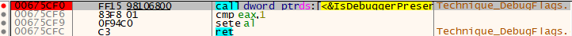
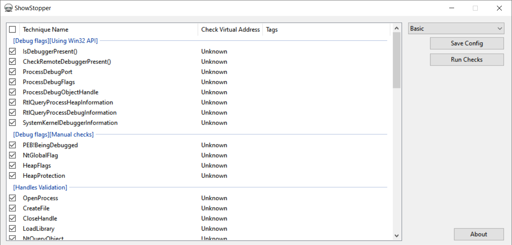
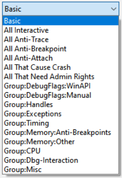
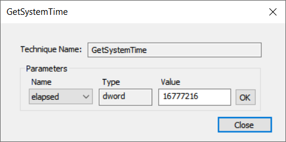
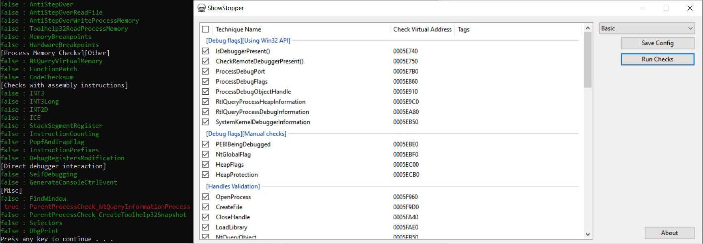

# Table of Contents
1. [Intsallation](#intsallation)
2. [How to use](#how-to-use)
    1. [Console application](#console-application)
    2. [GUI application](#gui-application)
    3. [Config syntax](#config-syntax)
3. [How to contribute (adding a new technique)](#how-to-contribute-adding-a-new-technique)

# Intsallation
1. Download the latest release and save the files `not_suspicious.exe`, `ShowStopper.exe` and `config.json` to the same location.
2. Run `not_suspicious.exe` from the command line<br>
   or<br>
   Double-click `ShowStopper.exe`.

# How to use

## Console application
The console application `not_suspicious.exe` has the following options:<br/>
```bat
Usage:
  not_suspicious.exe [OPTION...]

  -h, --help           Show Help
  -c, --config arg     Path to the JSON config
  -i, --info           Show the description for each technique
  -a, --auxiliary arg  Execute auxiliary function

 Techniques options:
      --admin   Allow techniques that require Admin privilege
      --crash   Allow techniques that may crash the process
      --trace   Allow techniques that work only when the technique's code is
                traced
      --break   Allow techniques that require setting a breakpoint
      --attach  Allow techniques that require a debugger to be attached after
                the program was run
```

To run the application, pass the path to a configuration file to it by using `--config` or `-c` options:
```bat
not_suspicious.exe --config <PATH_TO_JSON_CONFIGURATION>
```
To create a JSON configuration, see [the corresponding section](#config-syntax).
<br/><br/>
The option `--auxiliary` or `-a` lets you change the default behavior or the application and is usually used by the application itself or by the GUI.
<br/><br/>
The rest of the options allow you to manage how the application decides which techniques it will check and which it will not. By default, techniques that may crash debuggers or that need admin privilege are not executed. You can force the application to execute non-default techniques by specifying the corresponding options explicitly.<br/>
The following options are used:
<table>
    <tr>
        <th>Option</td>
        <th>Description</td>
    </tr>
        <td>admin</td>
        <td>
            Some techniques may work only with a certain privilege or in a process with a high integrity level. This means you must run the application with administrator privilege.
        </td>
    <tr>
        <td>crash</td>
        <td>
            These techniques not necessary crash the debugger or the application itself. But after these techniques are applied, debugging is no longer possible. This option enables such techniques.<br>
            The returns come back as "false" because the execution is no longer possible after they are applied.
        </td>
    </tr>
    <tr>
        <td>trace</td>
        <td>
            This option enables techniques that can succeed only if you trace through their code with a debugger.
        </td>
    </tr>
    <tr>
        <td>break</td>
        <td>
            These techniques usually check if there any breakpoints in the code. They may need to set a software, memory or hardware breakpoint either to a random or to a specific location.
        </td>
    </tr>
    <tr>
        <td>attach</td>
        <td>
            This option usually must be used with the "--crash" option. It enables anti-attach options that may make the debugger terminate its execution after it attaches to the application process. We recommend waiting until the application checks all the options and stops waiting for a key to be pressed. Then you can attach to it with a debugger and the debugger will exit.
        </td>
    </tr>
</table>

After you run the application from a console, it prints the addresses of techniques it will check:
```bat
00675CF0 : IsDebuggerPresent()
00675D00 : CheckRemoteDebuggerPresent()
00675D60 : ProcessDebugPort
00675E10 : ProcessDebugFlags
...
00678B20 : DbgPrint

Press any key to start checks...
```
Press any button to continue the execution. Before you get to this point, you can attach to this process with a debugger and set a breakpoint to the technique (using printed addresses) that you want to explore:



Finally, when the execution is resumed and all techniques are checked, the following output appears:

```bat
[Debug flags][Using Win32 API]
false : IsDebuggerPresent()
false : CheckRemoteDebuggerPresent()
false : ProcessDebugPort
 true : ProcessDebugFlags
false : ProcessDebugObjectHandle
...
[Misc]
false : FindWindow
 true : ParentProcessCheck_NtQueryInformationProcess
 true : ParentProcessCheck_CreateToolhelp32Snapshot
false : Selectors
false : DbgPrint
Press any key to continue . . .
```

A result of `"false"` means that the debugger is not detected by using this technique. A result of `"true"` means that the debugger is detected.

## GUI application

The GUI application `ShowStopper.exe` helps you manage which techniques you want to test and generates the configuration files.<br/>
In the application window, select techniques you want to test and execute them by clicking the <b>Run Checks</b> button.<br/>
To save the selected techniques in a configuration file, click the <b>Save Config</b> button.



For your convenience, there is a list of options whose techniques can be selected at the same time.<br/>
<b>Basic</b> mode allows you to test the majority of anti-debug techniques that don't require an interaction with a debugger and high privilege.<br>
<b>All interactive</b> mode enables only techniques that require setting a breakpoint, tracing their code, attaching to the process, etc.<br/>
The rest of the modes select techniques that work with certain command-line options (`--trace`, `--break`, etc.) and/or techniques of that specific group.



You can edit a technique’s parameters. To open the parameters editor window, double click on a technique in the table.



After running anti-debug checks, the GUI application passes the selected techniques to `not_suspicious.exe` uisng the `--auxiliary` option. The console application sends the GUI the virtual addresses of functions that apply the selected checks. You can attach a debugger to `not_suspicious.exe` while it is waiting for any key to be pressed, and set breakpoints to techniques you want to explore.



### Copy addresses to the clipboard

You can copy a virtual address to the clipboard using right click on the row with the corresponding technique.

## Config syntax

The configuration contains a list of technique groups that may contain subgroups, sub-subgroups or the techniques themselves.<br/>
This is an example from the default config:
```json
[
    {
        "name": "Debug flags",
        "subgroups": [
            {
                "name": "Using Win32 API",
                "subgroups": [
                    {
                        "name": "IsDebuggerPresent()"
                    },
                    ...
                ]
            },
            {
                "name": "Manual checks",
                "subgroups": [
                    {
                        "name": "PEB!BeingDebugged"
                    },
                    ...
                ]
            }
        ]
    },
    {
        "name": "Handles Validation",
        "subgroups": [
            {
                "name": "OpenProcess"
            },
            ...
        ]
    },
    ...
    {
        "name": "Timing",
        "subgroups": [
            {
                "name": "RDTSC",
                "parameters": [
                    {
                        "name": "elapsed",
                        "type": "dword",
                        "value": "1280"
                    }
                ]
            },
            ...
        ]
    },
    ...
    {
        "name": "Misc",
        "subgroups": [
            ...
            {
                "name": "Selectors",
                "tags": [ "trace" ]
            },
            ...
        ]
    }
]
```

There are four groups of techniques in the listed config:
* Debug flags
* Handles Validation
* Timing
* Misc

Group <b>Debug flags</b> contains two subgroups: <b>Using Win32 API</b> and <b>Manual checks</b>.<br>
<b>Groups and subgroups are JSON nodes that contain children nodes.</b><br/>
<b>Nodes that do not contain children nodes are called Techniques.</b> They may have tags and parameters.
<br/><br/>
<u>For example:</u><br/>
Group <b>Misc</b> has the technique <b>Selectors</b> with the <b>trace</b> tag.<br/>
Technique <b>RDTSC</b> has one parameter whose name is <b>elapsed</b>. This parameter is a 4-byte number whose value is 1280.
<br/><br/>
Parameters can have the following types:
* "dword" - 4-byte number.
* "qword" - 8-byte number.
* "real" - Double-word number (example: 10.42).
* "string" - ASCII string.

Parameters must have different names and must fit their type size.

# How to contribute (adding a new technique)

## 1. Define a name and the ID for a new technique.

First of all, you should define how the technique will be called in the project. Let's call it `TestTrick`.<br/>
Open the file `include/config.h` and add a new technique to a corresponding group in `ETechnique` enum and `TechniqueToName` map.<br/>
Let's assume we put our new technique to the <b>Misc</b> group:
#### **`include/config.h`**
```cpp
namespace Config
{
    enum class ETechnique
    {
        ...
    // Misc
        FindWindowA,
        ParentProcessCheck_NtQueryInformationProcess,
        ParentProcessCheck_CreateToolhelp32Snapshot,
        Selectors,
        DbgPrint,
        DbgSetDebugFilterState,
        TestTrick,
    };

    const std::map<ETechnique, std::string> TechniqueToName = { 
        ...
    // Misc
        { ETechnique::FindWindowA, "FindWindow" },
        { ETechnique::ParentProcessCheck_NtQueryInformationProcess, "ParentProcessCheck_NtQueryInformationProcess" },
        { ETechnique::ParentProcessCheck_CreateToolhelp32Snapshot, "ParentProcessCheck_CreateToolhelp32Snapshot" },
        { ETechnique::Selectors, "Selectors" },
        { ETechnique::DbgPrint, "DbgPrint" },
        { ETechnique::DbgSetDebugFilterState, "DbgSetDebugFilterState" },
        { ETechnique::TestTrick, "TestTrick" },

    };
}
```

## 2. Implemnet a technique.

Now you can implement a technique in one of the following modules from the `src/not_suspicious/` directory:
* `Technique_DebugFlags.cpp` & `Technique_DebugFlags.h`
* `Technique_HandlesValidation.cpp` & `Technique_HandlesValidation.h`
* `Technique_Exceptions.cpp` & `Technique_Exceptions.h`
* `Technique_Timing.cpp` & `Technique_Timing.h`
* `Technique_MemoryChecks.cpp` & `Technique_MemoryChecks.h`
* `Technique_Assembler.cpp` & `Technique_Assembler.h`
* `Technique_DirectDbgInteraction.cpp` & `Technique_DirectDbgInteraction.h`
* `Technique_Misc.cpp` & `Technique_Misc.h`

If this new technique does not require holding a state of storing some additional information, you can use the following macros to declare and implement the new technique:
#### **`src/not_suspicious/Technique_Misc.h`**
```cpp
...
DECLARE_TECHNIQUE(TestTrick);
...
```
#### **`src/not_suspicious/Technique_Misc.cpp`**
```cpp
...
CHECK_TECHNIQUE(TestTrick)
{
    bool bDebugged = false;
    // implementation
    ...
    return bDebugged;
}
...
```
If you need to store some information for the technique implementation, or this new technique includes parameters, you should use more detailed code:
#### **`src/not_suspicious/Technique_Misc.h`**
```cpp
...
class AntiDebug_TestTrick : public Technique
{
public:
    AntiDebug_TestTrick(const std::string name, const std::shared_ptr<AntiDebug> &parent);
    virtual bool Check() const;

private:
    DWORD m_dwSomeVariable;
};
...
```
#### **`src/not_suspicious/Technique_Misc.cpp`**
```cpp
...
AntiDebug_TestTrick::AntiDebug_TestTrick(const std::string name, const std::shared_ptr<AntiDebug> &parent)
    : Technique(name, parent)
    , m_dwSomeVariable(42)
{
}
bool AntiDebug_TestTrick::Check() const
{
    // implementation that uses m_dwSomeVariable
}
...
```
Here is an example of how the class must be implemented if the variable is read from config:
#### **`src/not_suspicious/Technique_Misc.h`**
```cpp
...
class AntiDebug_TestTrick : public Technique
{
public:
    AntiDebug_TestTrick(const std::string name, const std::shared_ptr<AntiDebug> &parent);
    virtual void AddParameter(std::string &name, ParamValue &value);
    virtual bool Check() const;

private:
    DWORD m_dwSomeVariable;
};
...
```
#### **`src/not_suspicious/Technique_Misc.cpp`**
```cpp
...
AntiDebug_TestTrick::AntiDebug_TestTrick(const std::string name, const std::shared_ptr<AntiDebug> &parent)
    : Technique(name, parent)
    , m_dwSomeVariable(42) // default value
{
}
void AntiDebug_TestTrick::AddParameter(std::string &name, ParamValue &value)
{
    if (name == "some_variable")
        m_dwSomeVariable = std::get<ParamType::Dword>(value);
}
bool AntiDebug_TestTrick::Check() const
{
    // implementation that uses m_dwSomeVariable
}
...
```

## 3. Bind the technique ID with the technique class.

Now that you have both the technique ID and technique implementation, you need to bind them in the `DebuggerFugitive` class:
#### **`src/not_suspicious/DebuggerFugitive.h`**
```cpp
...
class DebuggerFugitive
{
public:
    DebuggerFugitive() {}
    DebuggerFugitive(std::map<std::string, bool> &cnf)
        : m_mExecutionOptions(cnf)
    {}
    ~DebuggerFugitive() {}

    BEGIN_TECHNIQUE_MAP()
        ...
        ON_TECHNIQUE_ID(Config::ETechnique::TestTrick, AntiDebug_TestTrick)
    END_TECHNIQUE_MAP()
    ...
};
...
```

## 4. Add the new technique to the default config.

Finally, you can add the technique to the default config.

#### **`config/config.json`**
```json
...
    {
        "name": "Misc",
        "subgroups": [
            {
                "name": "FindWindow"
            },
            {
                "name": "ParentProcessCheck_NtQueryInformationProcess"
            },
            {
                "name": "ParentProcessCheck_CreateToolhelp32Snapshot"
            },
            {
                "name": "Selectors",
                "tags": [ "trace" ]
            },
            {
                "name": "DbgPrint"
            },
            {
                "name": "DbgSetDebugFilterState",
                "tags": [ "admin" ]
            },
            {
                "name": "TestTrick"
            }
        ]
    }
]
```

If there is a variable that can be defined in config, add the corresponding subnode:
#### **`config/config.json`**
```json
...
    {
        "name": "Misc",
        "subgroups": [
            ...
            {
                "name": "TestTrick",
                "parameters": [
                    {
                        "name": "some_variable",
                        "type": "dword",
                        "value": "1042"
                    }
                ]
            }
        ]
    }
]
```

## 5. Rebuild the solution.

Rebuild the solution. Afterward, you can use the new technique using both the console and the GUI application.
